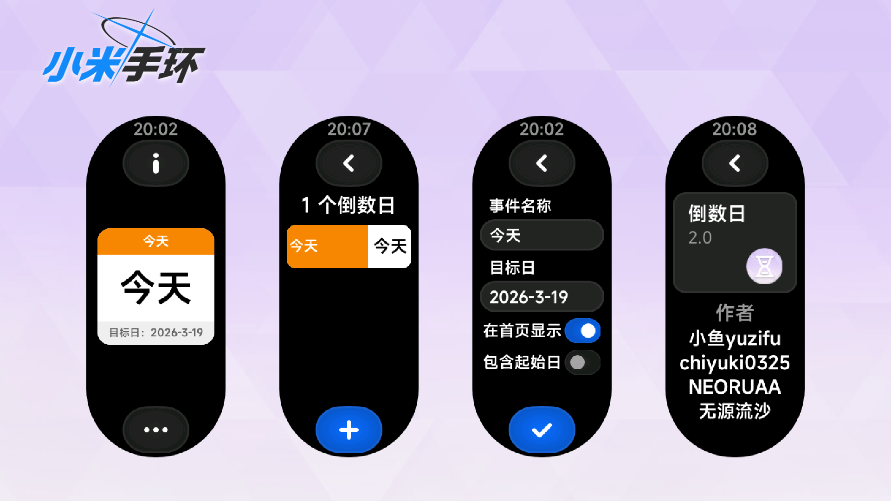
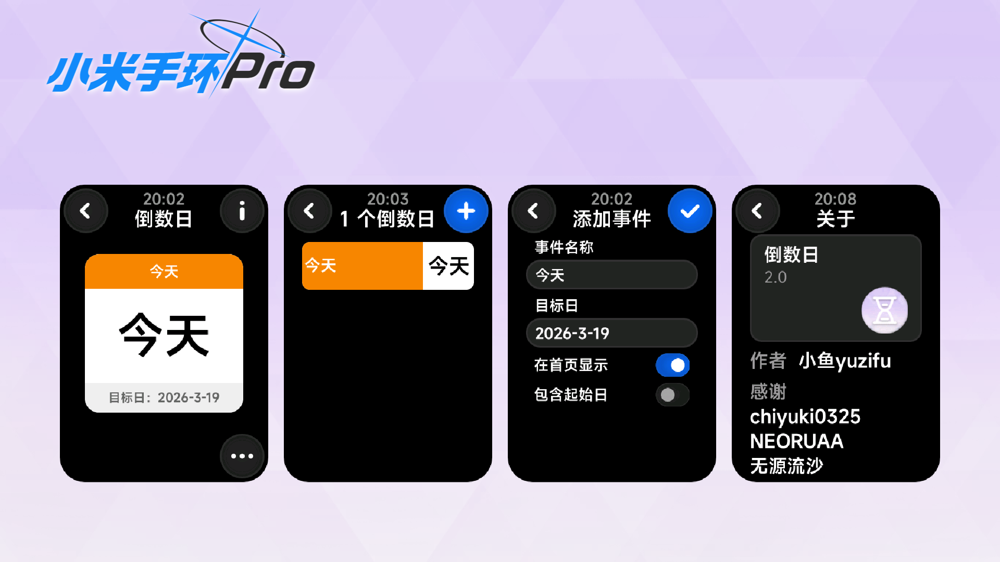
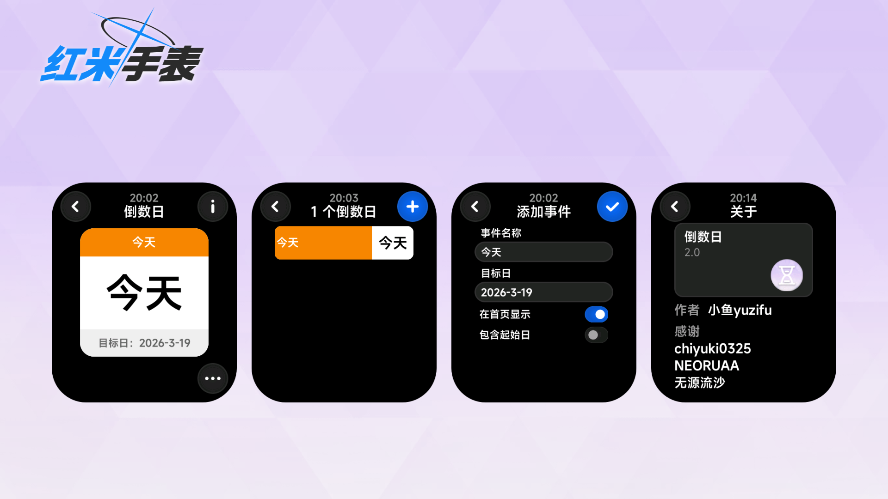
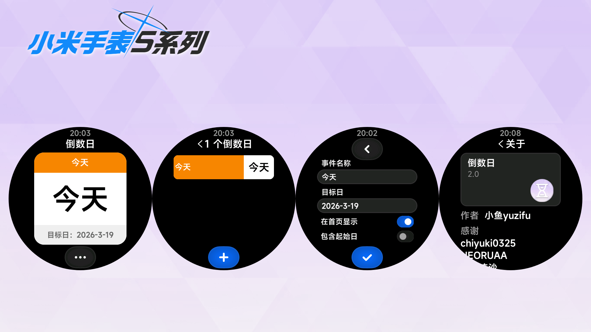

<p align="center">
  
</p>
<h1 align="center">倒数日 快应用</h1>
<p align="center">
    一款专为Vela系统设计的倒数日快应用，帮助你在手腕上轻松管理重要日子的倒计时
</p>

## ✨ 功能特性

- **倒数日管理** - 添加、编辑、删除倒数日事件
- **精美UI界面** - 采用[无源流沙](https://www.bandbbs.cn/threads/14584/)设计的UI风格
- **便捷输入** - 集成[喵喵输入法组件](https://github.com/NEORUAA/Vela_input_method)，支持多种输入模式
- **表盘联动** - 对接倒数日表盘，实时同步数据
- **多语言支持** - 支持简体中文、繁体中文、英文等多语言
- **性能优化** - 内存占用优化，运行更流畅
- **多屏幕适配** - 支持不同屏幕尺寸，包括手环、手表等

## 📱 预览

<p align="center">
    
    
    
    
</p>

## 📦 安装与使用

### 环境要求
- Node.js >= 18.10

### 安装依赖
```bash
yarn
```

### 开发调试
```bash
npm run start
# 或
yarn start
```

### 构建发布
```bash
npm run release
# 或
yarn release
```

## 📁 项目结构

```
daymatter/
├── src/                    # 源代码目录
│   ├── common/            # 公共资源（图片、样式、字体）
│   ├── components/        # 组件
│   │   └── InputMethod/   # 输入法组件
│   ├── i18n/              # 国际化文件
│   ├── pages/             # 页面
│   │   ├── index/         # 首页
│   │   ├── list/          # 列表页
│   │   ├── edit/          # 编辑页
│   │   ├── datepicker/    # 日期选择器
│   │   ├── input/         # 输入页
│   │   └── about/         # 关于页
│   ├── app.ux             # 应用入口
│   ├── manifest.json      # 应用配置
│   └── config-watch.json  # 手表配置
├── images/                # 预览图片
├── package.json           # 项目配置
└── README.md              # 项目说明
```

## 👁️ 了解更多

你可以通过小米快应用的[官方文档](https://iot.mi.com/vela/quickapp)熟悉和了解快应用开发。


**注意**：请遵守相关法律法规，合理使用本项目。如有版权问题，请及时联系处理。

## 🤝 贡献

欢迎提交 Issue 和 Pull Request 来帮助改进这个项目。

## 📄 许可证

本项目采用 [GPL-3.0-or-later](LICENSE) 许可证开源。

## 🙏 致谢

- [chiyuki0325](https://github.com/chiyuki0325/) - 原始项目作者
- [无源流沙](https://www.bandbbs.cn/threads/14584/) - UI界面设计
- [NEORUAA](https://github.com/NEORUAA/) - 输入法组件


