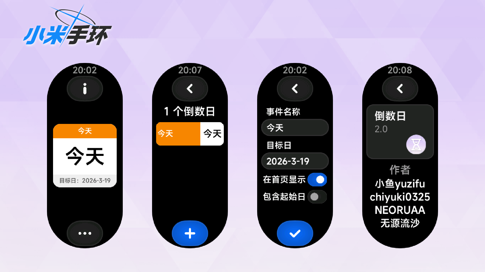
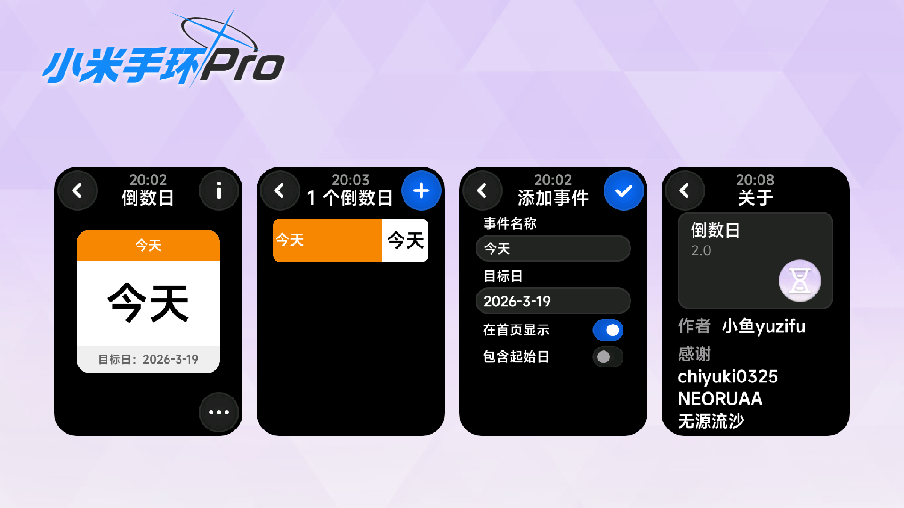
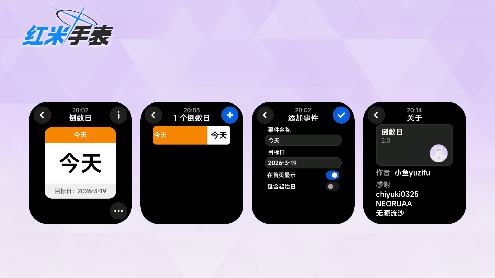
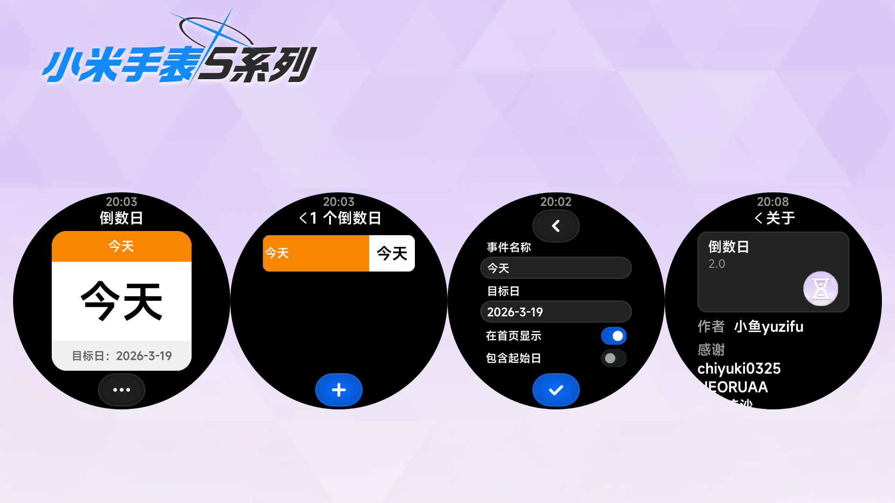

<p align="center">
  
</p>
<h1 align="center">倒数日 快应用</h1>
<p align="center">
    一款专为Vela系统设计的倒数日快应用，帮助你在手腕上轻松管理重要日子的倒计时
</p>

## ✨ 功能特性

- **倒数日管理** - 添加、编辑、删除倒数日事件
- **精美UI界面** - 采用[无源流沙](https://www.bandbbs.cn/threads/14584/)设计的UI风格
- **便捷输入** - 沿用[腕上漫画](https://github.com/sf-yuzifu/bandcomic)新版页面化键盘，基于[喵喵输入法](https://github.com/NEORUAA/Vela_input_method)，支持多种输入模式与多屏适配
- **表盘联动** - 对接倒数日表盘，实时同步数据
- **多语言支持** - 支持简体中文、繁体中文、英文等多语言
- **性能优化** - 内存占用优化，运行更流畅
- **多屏幕适配** - 支持不同屏幕尺寸，包括手环、手表等

## 📱 预览

<p align="center">
    
    
    
    
</p>

## 📦 安装与使用

### 环境要求
- Node.js >= 18.10

### 安装依赖
```bash
yarn
```

### 开发调试
```bash
npm run start
# 或
yarn start
```

### 构建发布
```bash
npm run release
# 或
yarn release
```

### 键盘与编辑流程回归
```bash
npm run test:ime
```
该检查运行页面脚本，覆盖键盘确认 / 取消、草稿保留、资源路径及编辑往返流程；实际触控、渲染和内存表现需在设备上验证。键盘采用腕上漫画的新版独立页面，点击输入行确认，系统返回取消，事件仍在编辑页点击保存后写入。

### 内存回落复核（模拟）
```bash
npm run test:memory
```
在 Node 模拟页面栈中连续进入 / 退出键盘、日期、更多候选、分页列表、首页和关于页，断言隐藏 / 销毁后大块数据与缓存已释放，并输出数组规模及 GC 前后 JS 堆数值。该数值来自 Node 模拟（`--expose-gc`），真机 JS 堆 / 原生内存仍需在设备上按 A-05 记录。

### 无损图片优化
```bash
# 检查并无损优化 src/ 下的 PNG 图片（保证 RGBA 像素 100% 一致）
npm run optimize:png

# 仅检查可优化空间，不改写文件
node tools/optimize-png.cjs --check
```

### 图片尺寸与解码预算复核
```bash
# 检查全部图片的物理分辨率与页面组件显示尺寸比值、解码内存占用
npm run check:budget
```

### 包体基线与逐项优化验收
```bash
# 分析当前版本的已有 release RPK
npm run analyze:size

# 对照固定的优化前基线；差值为负数表示缩小
npm run analyze:size -- --baseline tools/size-baseline.json

# 指定其他发布包
npm run analyze:size -- dist/com.yzf.daymatter.release.2.1.rpk --baseline tools/size-baseline.json

# 输出纯 JSON，便于记录分析结果
node tools/analyze-size.cjs --json
```
命令只读取已有产物，输出完整包体、资源分类 / 目录的压缩与未压缩体积、文件数、产物 SHA-256、构建元数据及可核实的签名证书指纹。

`tools/size-baseline.json` 固定记录优化前的 `2.1 / 21001` 发布包。优化后保持同一构建命令和签名方式，再与该基线对照。报告中的 release 命令来自分析时的项目配置，历史构建信息来自 RPK；配置变化会单独列出。未压缩体积与图片文件体积均不代表真实运行内存。

## 📁 项目结构

```
daymatter/
├── src/                    # 源代码目录
│   ├── common/            # 公共资源（图片、样式、字体）
│   ├── i18n/              # 国际化文件
│   ├── pages/             # 页面
│   │   ├── index/         # 首页
│   │   ├── list/          # 列表页
│   │   ├── edit/          # 编辑页
│   │   ├── datepicker/    # 日期选择器
│   │   ├── ime/           # 新版独立键盘页及完整输入法资源
│   │   └── about/         # 关于页
│   ├── app.ux             # 应用入口
│   ├── manifest.json      # 应用配置
│   └── config-watch.json  # 手表配置
├── images/                # 预览图片
├── package.json           # 项目配置
└── README.md              # 项目说明
```

## 👁️ 了解更多

你可以通过小米快应用的[官方文档](https://iot.mi.com/vela/quickapp)熟悉和了解快应用开发。


**注意**：请遵守相关法律法规，合理使用本项目。如有版权问题，请及时联系处理。

## 🤝 贡献

欢迎提交 Issue 和 Pull Request 来帮助改进这个项目。

## 📄 许可证

本项目采用 [GPL-3.0-or-later](LICENSE) 许可证开源。

## 🙏 致谢

- [chiyuki0325](https://github.com/chiyuki0325/) - 原始项目作者
- [无源流沙](https://www.bandbbs.cn/threads/14584/) - UI界面设计
- [NEORUAA](https://github.com/NEORUAA/) - 输入法组件


