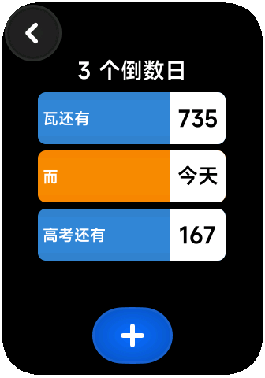

# 小米手环 倒数日 快应用

基于 [chiyuki0325项目](https://github.com/chiyuki0325/miband9-countdown/) 二改

## 改动内容
1. 使用无源流沙的UI界面和NEORUAA的输入法组件
2. 优化了下内存占用
3. 对接了倒计时表盘
4. 修复倒数日不跟随系统时间的问题
5. 修复右滑返回界面历史重复问题

## 目前已知存在的问题
1. 编辑界面偶尔有元素渲染不全
2. 有概率的卡退（至少我没有）

## 预览

     
    

